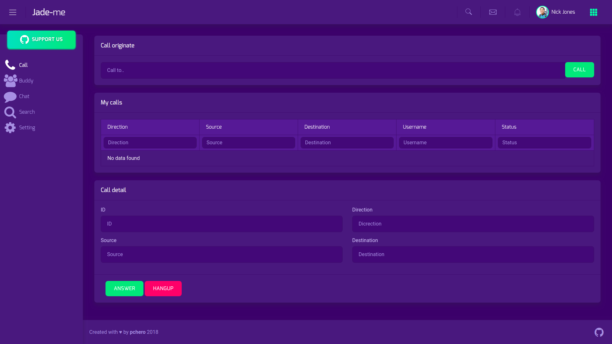

## jade-me
The jade-me is a simple user tool for jade.

## Features
* Chat function.
* Buddy function.
* Voice call(WebRTC/JsSip)

## Installing
Required jade(https://github.com/pchero/jade).

```
$ npm install
$ npm start
```

## Demo
You can try it at here.

ID/Password
- test1/test1
- test2/test2
- ...

https://project.pchero21.com:8202/

[](./jade-me.png)

## License
BSD License

## Remember 2014.04.16
* Still remember 2014.04.16
* Rest in peace..
* https://en.wikipedia.org/wiki/Sinking_of_MV_Sewol